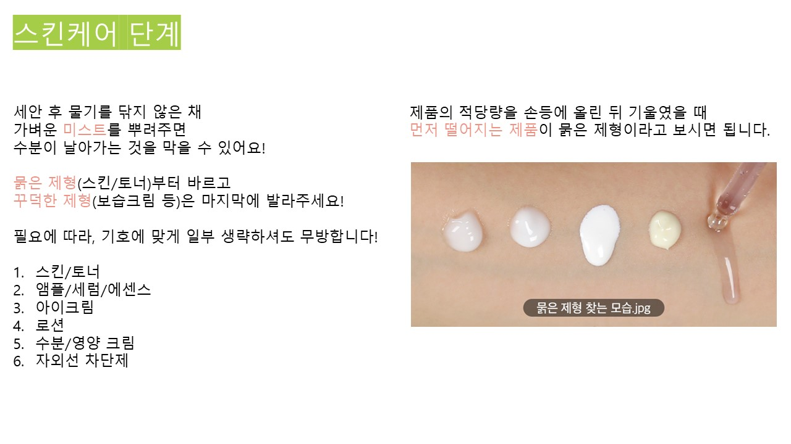
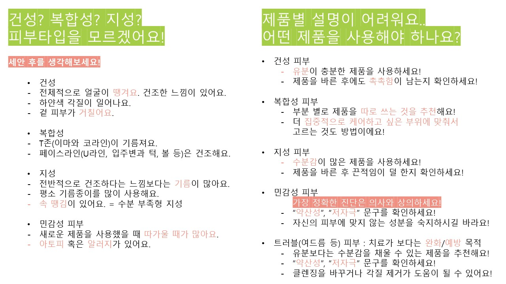
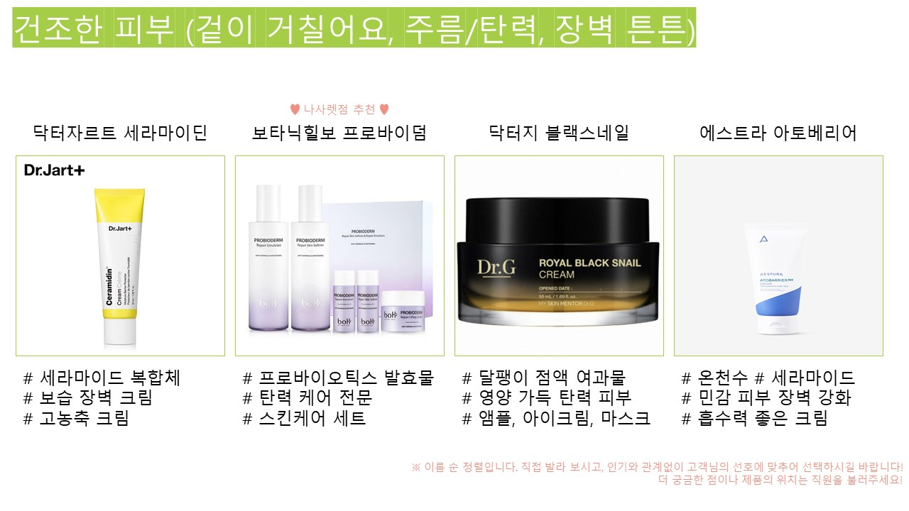
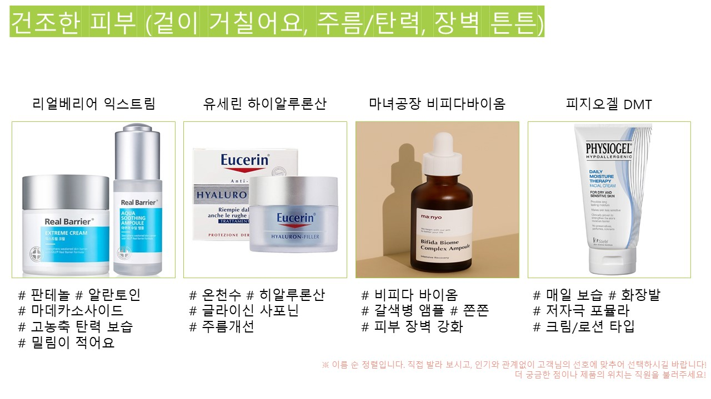
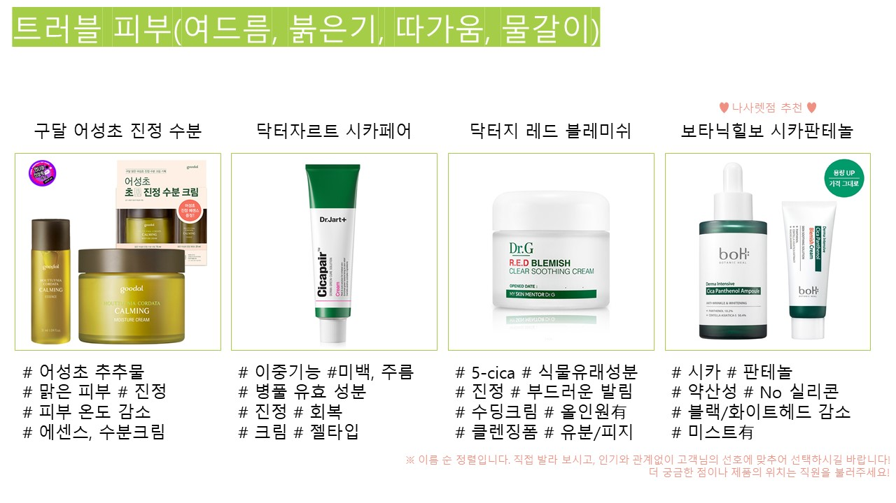
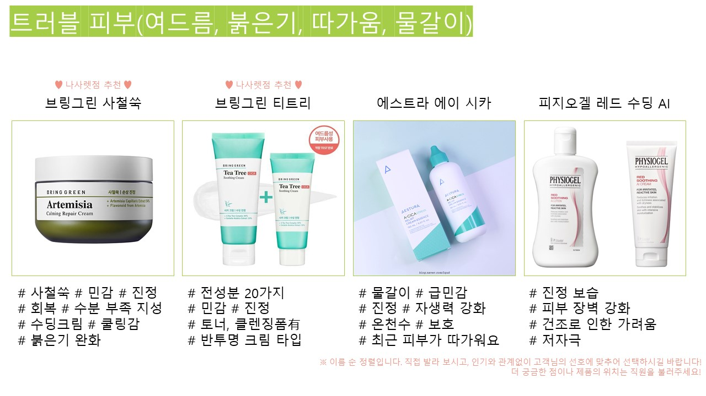
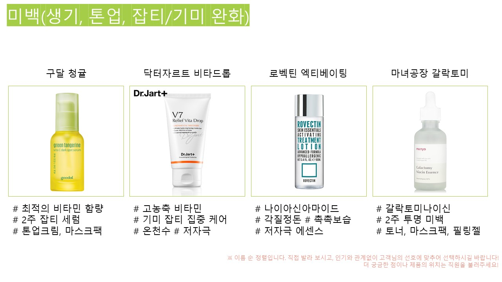
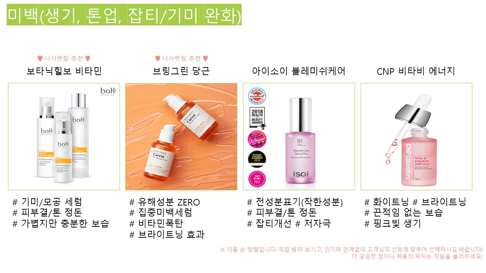
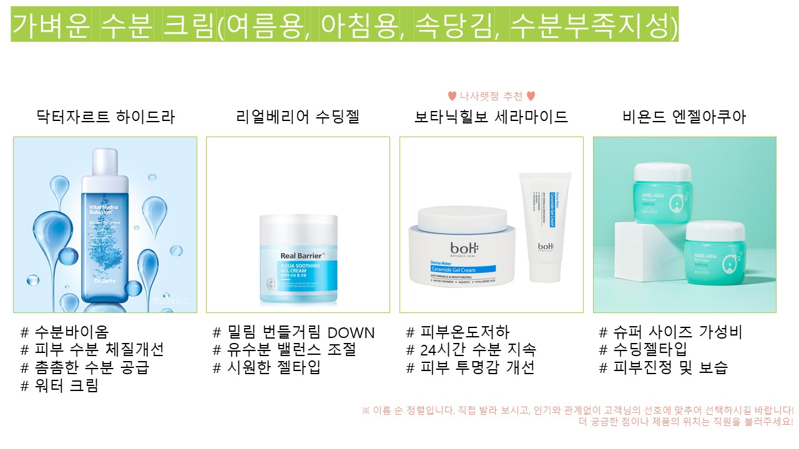

---

본 게시물은 프로그램 작성 전 프로젝트의 필요성과 MVP를 제안하기 위함입니다.

MVP : Minimum Viable Product

프로그램 작성에 대한 내용은 없습니다.

---


# 소개(Introduction)

**"찾으시는 상품 있으면, 말씀해주세요~"**

화장품 가게에서 익숙하게 들을 수 있는 목소리이고, 실제 CJ 올리브영의 mate로서 근무하는 내내 쉬지 않고 이야기하는 멘트입니다. 하지만, 실제로 도움을 청하는 분은 극히 드물고, 스스로 인터넷을 검색하거나 테스터를 직접 발라보시는 고객님들이 많습니다.


**가장 큰 문제는 이것이 구매로 이어지지 않는다는 것입니다.**


화장품 시장이 커지고, 개개인의 관심이 늘어나면서 구매 전에 스스로 제품을 비교하고 선택할 수 있는 플랫폼이 등장하고 활성화되었습니다.
심지어 화장품 관련 방송과 컨텐츠도 쏟아져나오고 있어, 마음만 먹으면 다양한 상품의 구체적인 정보까지 쉽게 습득할 수 있는 환경이 되었습니다.

하지만, 제가 직접 러쉬(LUSH)와 올리브영에서 근무해오면서, 오프라인 매장을 찾은 고객님들께서 아직까지 제품 선택에 어려움을 겪고 있음을 알게 되었습니다. 직원의 도움을 받기 위해 매장을 찾아도 다양한 이유로 원하는 제품을 구매하지 못하셨다는 이야기도 자주 듣습니다.
그 이유는 대개 아래의 경우였습니다.

- 고객 본인의 스킨 케어 지식 부족
- 대면 응대에 대한 부담
- 직원 불친절
- 직원의 상품 지식 혹은 설명 부족
- 매장 혼잡으로 인한 응대 불가
- 기타


조금 더 나은 서비스는 물론, 소비자 스스로 제품에 대한 정보를 습득할 수 있는 환경을 만드는 것이 중요하다고 생각했습니다.
이에 간단한 **'맞춤형 후보 추천 프로그램'**을 만들어보고자 합니다.

기존의 플랫폼(화해, 글로우픽 등)의 경우, 어플 다운로드와 간단한 회원가입으로 전문적인 내용(알러지 성분 등)을 확인할 수 있고, 수많은 리뷰가 소비자의 선택을 돕습니다.
저는 이보다 간단하지만, 핵심적인 부분만 짚어서 "후보"를 추천하고, 오프라인 매장 방문 활성화에 도움이 될 수 있는 프로그램을 작성하려합니다.


# 시장조사(Market Research)

일반 고객들이 화장품(특히 기초제품)을 구매할 때 주로 어떤 생각을 하고, 어떤 불편을 갖는지에 대한 생각을 알아보기 위해 설문조사를 시행했습니다.
2020년 5월 18일부터 시작된 본 설문은 6월 6일 기준 137명이 응답해주셨습니다. 설문에 참여해주신 모든 분들께 감사드립니다.
아직 설문에 참여하지 않으셨다면 조금만 시간 내주시면 감사하겠습니다. 응답시간은 약 1~2분입니다. ([설문조사 링크](https://forms.gle/S7bF34oTNFCkhFS66))


## 설문조사 항목

1. '연령대를 선택해주세요. (2020 - "출생년도" + 1의 결과값)',
2. '성별을 선택해주세요',
3. '기초제품을 구매하거나 선물한 적이 있나요?',
4. '평소 화장품에 대한 관심/지식은 어느정도인가요? (복수응답 가능)',
5. '기초제품 구매 시, 선택에 어려움을 겪은 적이 있나요? 그 이유를 말씀해주세요. (복수응답가능)',
6. '화장품 구매에 있어, 오프라인 매장 방문의 목적이 무엇인가요? (복수응답)',
7. '오프라인 매장 방문을 꺼리는 이유는 무엇인가요?',
8. '화장품과 관련하여 유튜브로 정보를 탐색하시나요?',
9. '화장품과 관련한 어플을 사용하시나요? (화해, 글로우픽 등)',
10. '화장품과 관련하여 유튜브 혹은 어플을 사용하는 이유는 무엇인가요?',
11. '어떻게 하면 기초 제품 구매가 더 편리할 것 같아요? (복수응답가능)'


## 설문의 결과

### 1. 오프라인 매장 방문을 꺼리는 이유에 대한 응답 살피기

* 오프라인 매장 방문을 조금이라도 꺼리는 고객의 비율 60.66%

* 온라인을 선호하기 때문에 굳이 매장에 오지 않는 고객의 비율 31.08%

* 접객이 불편하거나 혼자 의사결정을 하고 싶은 고객의 비율 44.59%

	'오프라인 매장 방문을 꺼리지 않아요!': 58,
	'온라인 쇼핑에 익숙해져서': 20,
	'혼자 비교하고 결정하고 싶어서': 20,
	'직원들의 접객이 불편해서': 28,
	'혜택이 더 다양하고 많아서': 16,
	'집에서 나가고 싶지 않아서': 15,
	'온라인이 더 싸요': 1,
	'어플, 유튜브, 방송 등 스스로도 충분히 정보를 얻을 수 있어서': 18,
	'사람 많은 곳을 좋아하지 않아서': 1,
	'귀찮아서': 1,
	'온라인으로 더 저렴히 구매가능해서': 1,
	'온라인으로 받을 수 있는 혜택(ex.할인)이 많아서': 1,
	'나가기귀찮아서': 1

   중복된 응답을 통폐합하니 아래와 같은 결과가 나왔습니다.

   ```
'오프라인 매장 방문을 꺼리지 않아요!': 58,
'온라인 쇼핑에 익숙해져서': 20,
'혼자 비교하고 결정하고 싶어서': 20,
'직원들의 접객이 불편해서': 28,
'집에서 나가고 싶지 않아서': 17,
'어플, 유튜브, 방송 등 스스로도 충분히 정보를 얻을 수 있어서': 18,
'사람 많은 곳을 좋아하지 않아서': 1,
'온라인 구매가 혜택이 더 다양하고 많아서': 19
   ```


### 2. 혼자 고민하고 싶거나 접객이 불편한 사람들의 응답 살피기

  **'혼자 고민하고 싶어요'** 혹은 **'직원들의 접객이 불편해요'**에 응답한 사람은 총 41명으로, 전체의 약 30%입니다.

   구체적인 연령대를 살펴보면 아래와 같고,

   ```
   '20 ~ 24세': 21,
   '19세 이하': 6,
   '25 ~ 29세': 9,
   '40 ~ 44세': 2,
   '30 ~ 34세': 2,
   '35 ~ 39세': 0,
   '응답을 원하지 않음': 0,
   '45 ~ 49세': 0,
   '50 ~ 59세': 1
   ```

성별은 다음과 같습니다.

   ```
   '여성': 34, '남성': 7, '기타': 0, '응답을 원하지 않음': 0
   ```

그들의 기타의견

   >"사실 특징별로 상품요약은 잘되어있는편이라고 생각하는데 특히 화장품업계에서 무분별한 광고가 오히려 소비자들에게 혼란을 준다고 생각합니당"

   >"보통 하나의 브랜드별로는 분류 및 표기가 잘 되어있는데 사실 매장가서 고민하고 검색하는건 여러 브랜드간의 여드름진정라인 비교를 하는것 같아요. 직원분께 추천받는것도 한 브랜드내에서 제품군을 비교받기보단 모든 브랜드 통틀어서 내가 원하는 성분을 포함한 것 중 가성비가 좋거나 '효과'좋은 걸 추천받고 싶으니까요!"

   >"특징별 요약 + 상품별 비교가 잘 되어있으면 편할 거 같습니다"

   > '알레르기 유발성분을 정리 해주세요'

그 중, 특징별로 상품에 대한 요약 정리가 있었으면 좋겠다고 응답한 사람은 35명으로 약 85%였고, 전체 응답자 137명 중에서도 102명으로 약 83.61%였습니다.

또한, 20대 고객 중에서 접객이 불편하거나 혼자보고 싶다는 응답은 30명으로 20대 중 약 37.5%를 차지했고, 비대면 응대를 선호하거나 요약 정리를 원하는 20대는 74명으로 20대 중 약 92.5%를 차지했습니다.

반면, 40대 이상의 고객 중에서 접객이 불편하거나 혼자 보고 싶다는 응답은 3명으로 40대 이상 중 18.75%였고, 비대면 응대를 선호하거나 상품의 요약 정리는 원하는 응답은 12명으로 40대 이상 중 75%였습니다.


### 3. 오프라인 매장 방문 목적 살피기

```
'급해서 혹은 빨리 사용하고 싶어서': 3,
'온라인은 신뢰할 수 없어서': 2,
'제품을 직접 테스트하고 크기 등을 보려고': 43,
'사람에게 물어보고 구매하고 싶어서': 30,
'온라인 쇼핑이 익숙하지 않아서': 8,
'온라인 결제가 귀찮아서/불편해서': 15,
'집이랑 가까워서': 24,
'특별한 이유 없음': 1,
'샘플, 증정품 등 혜택이 더 다양하고 많아서': 10
```


### 4. 기초제품 구매에 어려움을 겪는 사람들의 응답 살피기

```
자신의 피부 타입에 맞게 기초제품을 고를 수 있다고 답하거나 업계의 종사자라고 답한 사람들을 제외한 응답 살피기
```

스킨 케어 제품을 혼자 결정할 수 없는 사람은 전체 응답자 135명 중 71명이고, 전체의 약 52.59%입니다. 그 중 100%가 스킨케어 지식부족으로 구매에 어려움을 겪은 적이 있다고 답했습니다.

```
'오프라인 매장 방문을 꺼리지 않아요!': 31,
'온라인 쇼핑에 익숙해져서': 10,
'혼자 비교하고 결정하고 싶어서': 8,
'직원들의 접객이 불편해서': 18,
'혜택이 더 다양하고 많아서': 6,
'집에서 나가고 싶지 않아서': 12,
'어플, 유튜브, 방송 등 스스로도 충분히 정보를 얻을 수 있어서': 8,
'귀찮아서': 1,
'온라인으로 더 저렴히 구매가능해서': 1
```

또한, 어떻게 하면  기초제품 구매가 편할 것 같은지에 대한 질문에 대한 응답은 아래와 같습니다.

```
'비대면 응대를 활성화해주세요(낯을 가려요, 집에서 쇼핑하고 싶어요, 혼자 고민하고 싶어요 등)': 14,
'직원의 대면 응대를 활성화해주세요(상담은 사람과 만나서 하고 싶어요, 추천받은 제품을 사는 것이 마음 편해요 등)': 16,
'특징별로 상품에 대한 요약 정리를 해주세요(보습라인 : 가,나,다 / 여드름 진정 : A,B,C / 미백라인 : x,y,z 등)': 59,
'보통 하나의 브랜드별로는 분류 및 표기가 잘 되어있는데 사실 매장가서 고민하고 검색하는건 여러 브랜드간의 여드름진정라인 비교를 하는것 같아요. 직원분께 추천받는것도 한 브랜드내에서 제품군을 비교받기보단 모든 브랜드 통틀어서 내가 원하는 성분을 포함한 것 중 가성비가 좋거나 '효과'좋은 걸 추천받고 싶으니까요!': 1,
'응답을 원하지 않아요': 2,
'알레르기 유발성분을 정리 해주세요': 1
```


### 5. 설문조사 결과 정리

1. 오프라인 매장을 조금이라도 꺼리는 이유 중 가장 큰 것은 접객이 불편해서이다. 온라인 쇼핑을 더 선호하기 때문이라는 응답은 두 번째로 가장 많았습니다. (오프라인 매장을 꺼리지 않는 사람의 비율 43%)
   - 오프라인 매장에서 접객은 사라지는 것이 좋을까?
   - 온라인 쇼핑이 가지지 못하는 오프라인 매장의 강점은 무엇일까? 어떤 점을 더 내세워야할까?
2. 접객이 불편하거나 혼자 고민하고 싶어하는 사람은 과반수 이상이 여자였고, 30대 이하가 월등히 많았습니다. 20대 중 약 37%가 접객을 선호하지 않았고, 92%가 특징별 요약 정리를 원했습니다. 반면, 40대 이상 중에서 접객을 선호하지 않는다는 사람의 비중은 약 18%였고, 75%가 요약정리를 원했습니다.
   - 천안 나사렛점의 40대 이상의 고객님을 위한 프로젝트라고 생각하기도 함
   - 40대 이상의 고객님들은 대개 접객에 대한 비호가 강하지 않고, 요약 정리도 원한다.
3. 일반적으로 오프라인 매장을 방문하는 이유는 제품을 직접 보고 싶기 때문에가 가장 많았고, 사람에게 직접 물어보고 싶다는 응답이 그 다음으로 많았습니다.
   - 온라인 쇼핑으로 해결되지 않는 것 = 제품을 직접 보는 것 = 오프라인 매장만의 강점
   - 사람에게 직접 물어보고 싶다는 응답 = 오프라인 매장에서의 접객이 사라지면 안된다. 아직 필요로 하는 사람이 꽤 많다.
4. 일반 고객의 과반수 이상(약 52%)이 스킨케어에 대한 지식이 부족하여 구매에 어려움을 겪은 적이 있다고 답했습니다. 그리고 약 83%가 특징별로 요약정리를 원했습니다.
   - 접객이 불편하다는 응답이 여전히 많지만, 여전히 약 43%(71명 중 31명)이 오프라인 매장 방문을 꺼리지 않는다고 답했다.


# MVP 만들어보기

**"특징별로 제품을 요약/정리하면 효과가 있을까?"**

설문의 응답을 토대로 생각을 정리해보면 아래와 같습니다.

1. 제품을 직접 보기 위해서 사람들은 오프라인 매장을 찾을 수 밖에 없다.
2. 접객을 꺼리는 사람들이 많긴 하지만, 40대 이상의 고객님들은 딱히 꺼리지 않았고, 약 20%의 사람들이 직접 물어보고 구매하고자 매장을 방문한다고 답했기 때문에 접객이 사라지는 것은 옳지 않다. - 20%는 생각보다 큰 비율이다. 5명 중 1명의 꼴로 접객을 필요로 하는 셈.
3. 어떤 식의 응답에서도 요약정리를 원하는 사람들이 월등히 많다. (약 76%)

하지만, 본 설문조사는 **한계점**이 있습니다.

1. 대개 응답자가 30명을 넘어서면 유의미한 설문으로 분류하고 100명 이상이면 신뢰할 수 있다고 말하기 때문에 137명의 응답은 상당히 힘을 가질 수 있습니다.
2. 하지만, 혼자 설문조사를 시행했기 때문에 대부분의 응답이 **'20대 여성'**으로 치우쳤습니다.
3. 지역도 천안, 서울에 집중되어 **다른 지역 주민의 응답은 적은 것**으로 보입니다.

경제력, 의사결정권을 가졌으나, 넘쳐나는 정보를 수집하지 않는 40대 이상의 고객을 위한 프로젝트였지만, 20대에 치중된 설문조사이기에 사이트 구현 전 조금 더 확실한 근거가 필요합니다.

그래서 스킨케어의 기본 단계와 특징별로 제품을 간략하게 정리한 종이를 매장에 비치했을 때 몇 명의 고객님들이 관심을 가지고, 참고하여 제품을 구매하는지에 대해서 살펴보기로 했습니다.

아주 빠르게 만들어서 빠르게 실험하고 철수할 예정이기 때문에 퀄리티는 중요하지 않다고 생각했습니다. 중요한 건 해당 정보에 얼마나 많은 고객님들이 관심을 갖는지 입니다.
제품의 사진은 각 홍보 사이트에서,  정보는 [Olive Young 홈페이지](www.oliveyoung.co.kr)에서 가져왔습니다.
매장에 비치하는 종이(MVP)는 아래와 같습니다.


## MVP - 스킨케어 방법과 추천 제품이 나온 종이를 비치



















