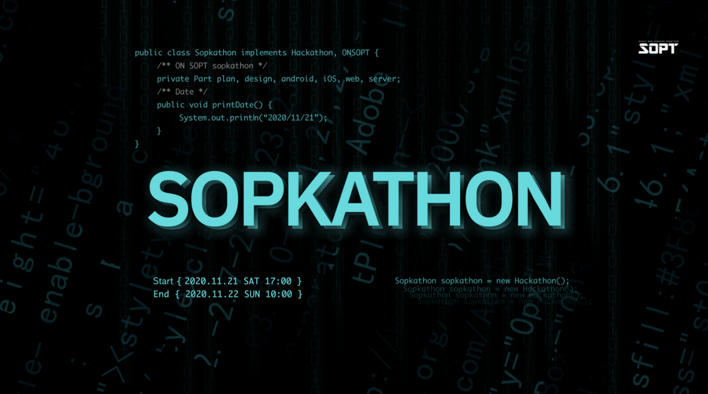
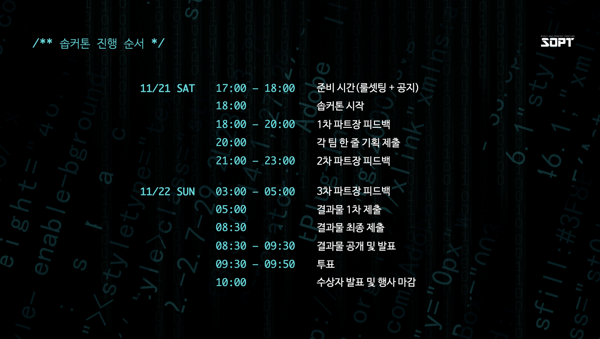
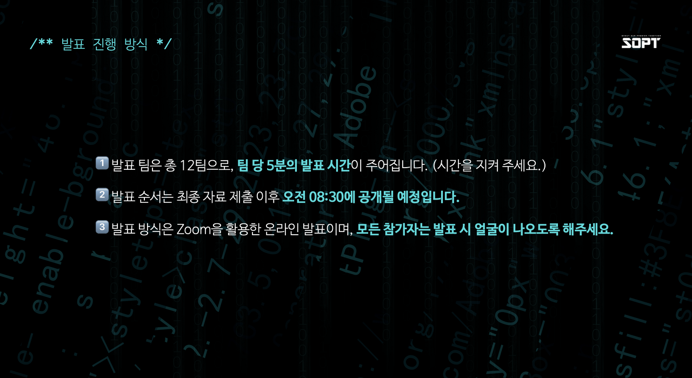
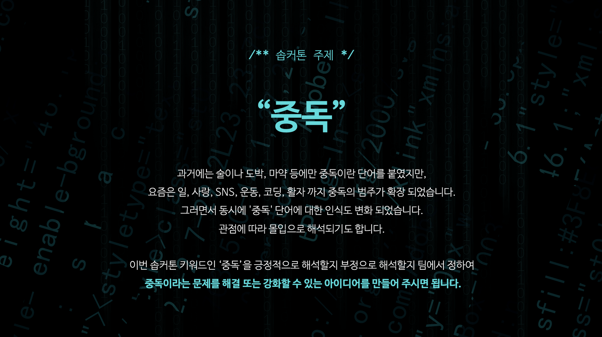

---

👨‍👧‍👧TEAM 11 어장관리

본 게시글은 아카이브를 위한 것으로,

서비스 웹페이지 구동영상과 발표 영상, 발표 자료는

[노션](https://www.notion.so/FISHING-065c942d96634843b9e9dc08d9f66e42)에서 확인 가능합니다!

---

# 솝커톤?

 

 



솝커톤(SOPTKATHON)이란, [IT 벤처 창업 동아리 SOPT](sopt.org)에서 진행하는 무박 2일 서비스 개발 해커톤을 말합니다. 기획, 디자인, 서버, 안드로이드, iOS, 웹파트원들이 모여 17시간동안 협업을 경험할 수 있습니다. 코로나로 인해 모든 팀이 한 자리에 모이지는 못하고, 팀 별로 자유롭게 온-오프라인 방식을 결정하여 해커톤을 진행했다. 전체 공지와 발표는 모두 zoom으로 진행되었습니다.



사진 출처 : SOPT 27th SOPTHKATHONE 공식 자료

27기 솝트 솝커톤의 주제는 **중독**이었습니다. 중독을 어떻게 해석할지, 그에 따라 어떤 서비스를 개발할지부터 시작했습니다. 본 게시물은 2020년 11월 21일 토요일부터 22일 일요일 오전까지 진행된 솝커톤 어장관리팀(11조)의 서비스 FISHING에 대한 기록입니다. 어장관리팀은 웹서비스를 담당했으며, 기획 2명, 디자인 2명, 서버 2명, 웹 3명으로 구성되었습니다. 팀원은 다음과 같습니다.

## 🤼‍♀️팀원 소개

| 이름   | 파트 | 닮은꼴   | 자기자랑                                                     |
| -------- | ------ | ---------- | ------------------------------------------------------------- |
| 김소령 | 기획 | 우파루파 | 치어리딩, 애니 안 본 오타쿠 (일본어 잘함), 팀장임               |
| 박주영 | 기획 | 다람이   | 문재인 대통령이랑 같이 영화 본 적 있음 (;;;)<br />고깃집 딸래미(였)어서 고기 잘 구움 |
| 김채윤 | 디자인 | 현아 | 피팅모델, 키가 174... 와 쩔었다 |
| 안소현 | 디자인 | 에일리, 여진구 | 피부가 좋음, 박치지만 음감이 미침 |
| 김우영 | 서버 | 부엉이 캐릭터 | 피아노 유튜버 무려 구독자 1.3만명 후덜덜~ |
| 윤가영 | 서버 | 아이유 | 제일 어림.. 무려 21살.. 노래 개잘함 |
| 김동관 | 웹 | 최자, 양현석 | 여친님 (.......)       |
| 박재성 | 웹 | 황치열, 족제비 | 피아노 잘침, 바이올린 후덜덜, 윤후 선배~ |
| 이현진 | 웹 | 쿼카 | 그림 개잘그림. 유태오한테 그림 언급당함 진짜 대박 성덕. |


## ✏기획 한 줄 설명

우리가 낚으려던 것은 정보가 아니라 **"당신들"**입니다. ..

쉼 없이 달려 온 솝트인들을 위한 쉬어가기 레퍼런스 페이지!


## 🕰문제 정의 및 솔루션

```
솝트 내 스터디 33개!
파트 내에서 끊임없이 공유되는 레퍼런스.
하루가 멀다하고 진행되는 모각공.
도대체 언제 쉬는지 모르겠는 솝트인들,
쉬는 날 집에서 뭘 해야하는지 모르겠다는 솝트인들.
그들을 위한 휴식 참고서 **FISHING**🐬
```

우리 어장관리팀에서 정의한 중독은 알코올중독도, 니코틴중독도, 게임중독도 아닌 소위 말하는 워커홀릭, 즉 **일중독**입니다. 우리 동아리 솝트의 구성원들을 보면서 '얘는 도대체 언제 쉬는거지..?'하는 생각을 자주 하기 때문입니다. 동아리 내 공식 스터디만 **33개**이고, 매일매일 파트별로 각종 **레퍼런스가 공유**됩니다. 즉흥적으로 만나서 **모각공(모여서 각자 공부)**도 진행합니다. 하루도 빠짐없이 학습과 일에 몰두하고 있고, **휴식 시간에 무엇을 해야 하는지 모르겠다**는 사람도 있었습니다.

그래서 우리가 준비한 웹서비스는 **"휴식 참고서"**입니다.

#### 웹서비스가 가지는 장점에 대해 생각하기

많은 서비스가 어플로 제작되면서 웹이 가지는 의미가 희미해졌다고 느끼는 사람들이 있을지도 모릅니다. 고유성이 떨어진다고 느끼는 사람이 있을지도 모르겠습니다. 앱으로 만들 때, 유저에게 **우리 서비스**라는 느낌을 더 전달할 수 있는 것도 사실입니다.

하지만, 웹서비스가 가지는 장점을 생각해보면 상당히 매력적입니다.

1. 설치가 필요없습니다. 앱은 모바일 환경에 최적화된 화면을 제공하지만, 설치하지 않으면 사용할 수 없다는 단점이 있습니다.
2. 넓은 PC 화면에서도 페이지를 확인할 수 있어, 지도처럼 한 눈에 담아야하는 정보들을 보여주기 좋습니다. 동시에 모바일에서도 접속할 수 있기 때문에 앱보다 더 다양한 환경에서 서비스를 제공할 수 있습니다.
3. 비교적 구현이 빠르고 정보가 많습니다. 더 오랜 시간 사람들이 이용해왔기 때문에 개발에 대한 정보가 다양하고 각종 레퍼런스와 라이브러리 등을 어렵지 않게 구할 수 있습니다.

이러한 점을 미루어볼 때, 아래와 같은 사항들을 고려해 일중독과 웹서비스를 엮었습니다.

1. 워커홀릭의 대부분은 모바일만큼 PC 사용에 익숙하고 할애하는 시간이 많다. 즉, 웹페이지가 더 접근에 용이할 수도 있다.
2. 회원가입과 로그인 절차까지 없앤다면 설치, 등록 없이 서비스를 더욱 간편하게 즐길 수 있다.

#### 바로 이야기하면 너무 재미없잖아!

"휴식 참고서"는 워커홀릭들에게 재밌는 레퍼런스가 될 수 있지만, 짧은 발표에 이를 모두 전달하는 것이 쉽지 않을 수도 있겠다는 생각을 했습니다. 그래서 우리는 중간 보고와 발표 초반까지 최종 서비스 모습을 모두 숨기기로 했습니다. **일중독을 장려하는 아티클 모음 사이트**라는 서비스라고 소개하고, 진짜 아티클을 찾으러 들어온 사람들에게 정보가 아닌 휴식과 관련한 이미지를 보여주고, 최종적으로는 자신만의 휴식 방법을 고민하게 하고 작성하여 공유하게 했습니다. 이로써, 또다시 쉬지 않고 달리려던 사람에게 강제로 브레이크를 걸어 일중독을 해소하는데 기여하고자 했습니다.

이에 맞게 서비스명도 For Ideal Sopt HitchhikING(이상적인 솝트 히치하이킹을 위해)의 약자인 FISHING이라고 명명했습니다. 서비스 내에서는 유저에게 랜덤한 별명을 부여하는데, 이 내용도 **휴식과 관련한 수식어** + **수중 생물명**을 조합한 단어로 설정하였습니다.

[더욱 자세한 설명과 영상, 발표 자료는 노션을 확인해주세요!](https://www.notion.so/FISHING-065c942d96634843b9e9dc08d9f66e42)


## 🚩 IA


## 🎨와이어 프레임


