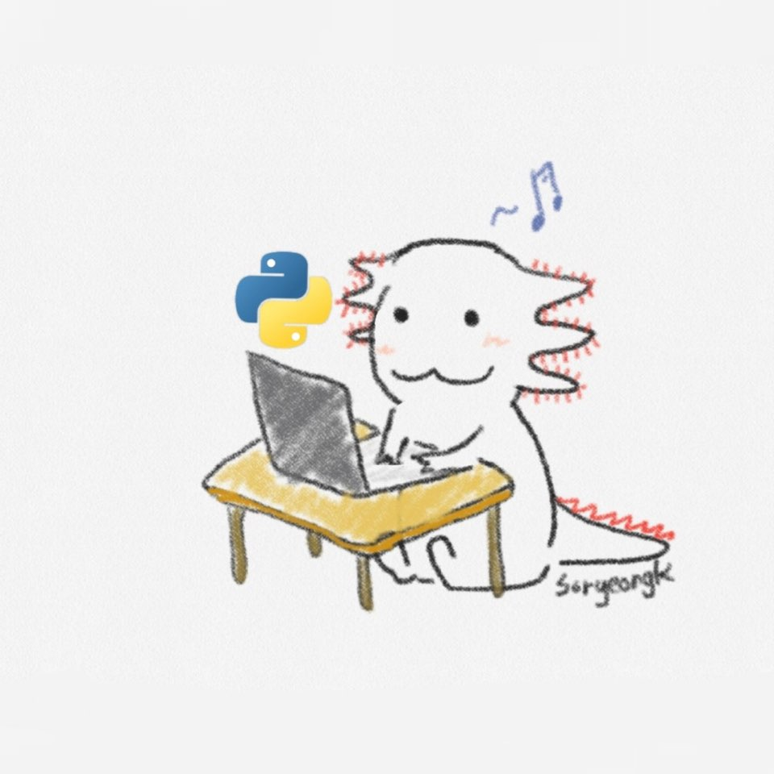

# soryeongk

단순히 코딩하는 모습이 멋있어서 시작한 공부지만, 저는 **개발에 진심**입니다.🐾


2018년 데잇걸즈 2기 수료를 계기로 본격적으로 컴퓨터 공부를 시작했습니다.

Python을 꾸준히 공부하면서 Data 분석, 머신러닝 공부를 시작하면서 스터디(Untitled.ipynb)를 운영했습니다.

데이터야놀자2018에서 연사자로 참여해 색데이터 분석 경험을 공유했고,

나아가 아동 장난감 색감 분석 프로젝트로 발전시켜 공부했습니다.

[데이터야놀자2020의 홈페이지](http://datayanolja.github.io)를 직접 개발했고, 현재는 관리를 맡고 있습니다.

특별한 기능이 없는 페이지이지만, 리액트를 경험해볼 수 있는 기회였습니다.

개인정보 없이 사용가능한 쿠폰/포인트 적립 시스템을 기획하고 개발하는 과정에 있습니다.

2020년, IT 벤처 창업 동아리 [SOPT](sopt.org) 27기 기획파트원으로 참여해 활동하고 있습니다.

두루뭉술한 표현보다는 제 생각을 **가능한 그대로 전달할 수 있는 커뮤니케이션 방법**을 지향합니다.

- 많은 사람들이 사용할 것 같아요(X) → 10명 중 7명 이상은 사용할 것 같아요(O)
- 이 부분은 줄이고 여기는 키워주세요(X) → 매장명 입력창은 글자보다 10%만 더 큰 정도로 조정해주시고, 입력 버튼은 일반적인 검지 손가락 크기로 입력에 무리가 없는 크기로 맞춰주세요. 약 48정도? (O)


영어와 일본어로 소통이 가능하며,

발표와 협업에 익숙하고, 주로 **기술리딩** 혹은 **PM**을 맡았습니다.




언제부터인지 친구들은 저를 우파루파라고 부릅니다.

단순히 외관이 닮아서 붙여진 별명인데, 개인적으로 가장 좋아하는 별명입니다.

우파루파는 둔하게 생긴 외관과 달리 어떤 상처도 빠른 시간에 **무한 재생**되는 반전 매력이 있습니다.

또한, 우파루파는 1급수의 깨끗한 물에만 사는 동물입니다.

그 말은 **우파루파가 있는 곳**은 **검증된 깨끗하고 좋은 환경**이라는 것입니다.

저는 우파루파의 그런 모습까지 퍽 닮아 있습니다.

# Education

* 2016.03 ~ now
  - 중앙대학교 재학중 (경영학 전공, 소프트웨어 융합전공)
* 2018.04 ~ 2018.06
  - 도쿄 월드 일본어 학교 (워킹홀리데이)
* 2018.06 ~ 2018.10
  - 빅데이터 전문가과정 데잇걸즈 수료
* 2013.03 ~ 2016.02
  - 충남외국어고등학교 영어/일본어학과 졸업


# Work Experience

* 2016.02 ~ 2017.12
	- (주)글로세움 경영&마케팅 인턴 및 프리랜서 멘토
```
(주)글로세움은 대학입시 수시전형 컨설팅 스타트업으로,
대학생 프리랜서 멘토를 양성하고 학생과 연결해주는 플랫폼입니다.
2016년 개업 후 인턴으로 선발되었으나,
2년 후 경영악화로 폐업하면서 회사를 나오게 되었습니다.
```

# Volunteering

* 2017.01 ~ 2018.03
  - 십시일밥 중앙대학교 대표
* 2016.09 ~ 2016.12
  - 십시일밥 중앙대학교 봉사자

```
십시일밥은 학생들이 공강시간에
교내 학생식당에서 일손을 도운 대가로 시급을 식권으로 환산받아
동문 학우들에게 이를 기부하는 대학생 연합 봉사단체입니다.
```


# Achievements

* 2019.02
  * JLPT N2 취득
* 2018.06 ~ 2018.07
  * 2018년 대학생 100인 토론 워크샵 한경닷컴 대표이사상(2등)
* 2017.06 ~ 2017.11
  * NSI 대학생 건전재정 가디언즈 5기 장려상


# Project List

* 2020.06.27 ~ now
  * 개인정보 수집 없는 쿠폰/포인트 적립
    * 아이디어 정리 노션 페이지 - 추후 공개
* 2020.11.21
  * [SOPT 27기 해커톤 웹페이지 FISHING의 PM](https://www.notion.so/FISHING-065c942d96634843b9e9dc08d9f66e42)
* 2018.10 ~ 2018.12
  * [Colors of Toys : 아동 장난감 색감 분석하기](https://github.com/soryeongk/Colors_of_Toys/blob/master/color%20analysis/codes_review.ipynb) - 정리 미완
* 2018.09 ~ 2018.10
  * [Next Hip Place : 자본이 주어진다면 어디에 건물을 살까?](https://github.com/soryeongk/Next_Hip_Place)
* 2018.08 ~ 2018.09
  * [Colors of Seoul [cafe] : 서울시내 카페 색감 분석하기](https://cafecolormap.github.io/html_page/html_cafe_color_map_iframe_main.html)


# Extra Experiences

* 2020.09 ~ now
  * IT 벤처 창업 동아리 [SOPT](sopt.org) 27기 기획
* 2020.11 ~ now
  * 데이터야놀자 홈페이지 관리
* 2020.07 ~ 2020.10
  * 데이터야놀자 2020 홈페이지 파트
* 2019.03 ~ 2020.02
  * 일본 도쿄 워킹 홀리데이
    * 2019.04 ~ 2020.02 신오오쿠보 수미네식당 부점장
    * 2019.10 ~ 2019.12 러쉬 신주쿠점 근무
* 2018.10 ~ 2018.12
  * Programming & Machine Learning 스터디(Untitled.ipynb) 리더
* 2018.10
  * 데이터야놀자 2018 프로젝트 발표
  * 프로젝트명 : [Colors of Seoul [cafe] : 서울시내 카페 색감 분석하기](https://www.slideshare.net/ssuser914e44/colors-of-seoul-cafe-122531311?qid=b5f37599-235f-4e0a-bd1e-1dc6eff0f950&v=&b=&from_search=1)
* 2018.10
  * Little Big Data Ignite 발표
  * 발표명 : 코딩 새내기, 데이터 새내기


# Contact me

email : [soryeongk.kr@gmail.com](soryeongk.kr@gmail.com)

Instagram : [soryeongk](www.instagram.com/soryeongk)